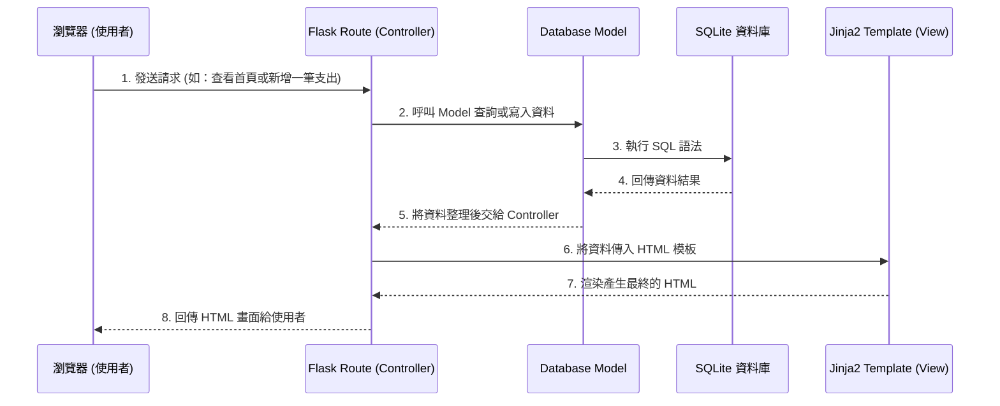

# 系統架構設計 (Architecture) - 個人記帳簿系統

本文件根據 PRD 需求，規劃了個人記帳簿系統的技術架構、資料夾結構與元件之間的關係。我們的目標是打造一個極簡、輕量且易於維護的網頁應用程式。

## 1. 技術架構說明

為了達到簡單快速開發及部署的目的，我們採用傳統的伺服器端渲染 (Server-Side Rendering) 架構，而非複雜的前後端分離架構。

### 選用技術與原因
- **後端框架：Python + Flask**
  - **原因**：Flask 輕量且靈活，非常適合中小型個人專案。不需要複雜的設定即可快速開發路由與 API。
- **模板引擎：Jinja2**
  - **原因**：與 Flask 完美整合，能夠在伺服器端直接將資料嵌入 HTML 頁面中，省去前端框架 (如 React/Vue) 的學習與維護成本。
- **前端技術：HTML + Vanilla CSS + Vanilla JavaScript**
  - **原因**：保持極簡設計，不引入龐大的 CSS 或 JS 框架。針對金額輸入欄位的「加減乘除四則運算」，將使用輕量的 Vanilla JS 在前端即時計算，確保順暢的使用者體驗。對於圖表分析（如圓餅圖），可引入輕量的圖表套件（如 Chart.js）。
- **資料庫：SQLite (搭配 SQLAlchemy 或內建 sqlite3)**
  - **原因**：零設定、無需獨立伺服器，資料儲存在單一檔案中，非常適合單人使用的記帳系統，備份也十分方便。

### Flask MVC 模式說明
雖然 Flask 本身是微框架，但我們將採用類似 MVC (Model-View-Controller) 的概念來組織程式碼：
- **Model (資料模型)**：負責定義資料庫的表格結構（如：`Transaction` 收支紀錄表），處理與 SQLite 資料庫的讀寫互動。
- **View (視圖)**：負責呈現使用者介面。在這裡指的是 **Jinja2 HTML 模板** 與靜態資源 (CSS/JS)。負責將 Controller 傳來的資料渲染成網頁。
- **Controller (控制器)**：負責處理商業邏輯與路由。在 Flask 中即是 **Routes (路由)**，負責接收瀏覽器的請求、從 Model 取得資料、進行運算，最後將結果傳遞給 View 渲染。

## 2. 專案資料夾結構

為了讓程式碼好讀好維護，我們將採用以下結構來分類不同職責的檔案：

```text
web_app_development/
├── app/                        # 應用程式核心目錄
│   ├── __init__.py             # 初始化 Flask 應用與擴充套件
│   ├── models/                 # Model: 資料庫模型定義
│   │   └── transaction.py      # 收支紀錄資料表設計
│   ├── routes/                 # Controller: Flask 路由與商業邏輯
│   │   ├── main.py             # 首頁與基本視圖路由
│   │   └── transaction.py      # 處理新增、刪除、分析收支等路由
│   ├── templates/              # View: Jinja2 HTML 模板
│   │   ├── base.html           # 共用的網頁排版 (Header, Footer)
│   │   ├── index.html          # 首頁 (當月總計、結餘、近期紀錄)
│   │   ├── form.html           # 新增收支的表單頁面
│   │   └── analysis.html       # 統計與圖表分析頁面
│   └── static/                 # 靜態資源 (CSS, JS, 圖片)
│       ├── css/
│       │   └── style.css       # 全站共用 CSS 樣式
│       └── js/
│           └── calculator.js   # 處理金額欄位四則運算的邏輯
├── instance/                   # 存放運行時產生的檔案 (不進版本控制)
│   └── database.db             # SQLite 資料庫檔案
├── docs/                       # 專案文件 (PRD, 架構文件等)
│   ├── PRD.md
│   └── ARCHITECTURE.md         # 本文件
├── requirements.txt            # Python 依賴套件清單 (如 Flask, SQLAlchemy 等)
└── run.py                      # 系統啟動入口
```

## 3. 元件關係圖

以下展示當使用者透過瀏覽器操作記帳系統時，各元件之間是如何互相溝通的。



## 4. 關鍵設計決策

1. **單體式架構 (Monolithic) 與伺服器渲染**
   - **決策**：不採用 API + 前端框架 (React/Vue) 的分離架構，而是直接用 Flask + Jinja2 回傳 HTML。
   - **原因**：此專案目標為簡單直覺的個人記帳簿，單體架構能最快實現 MVP，減少前後端溝通成本，降低維護門檻。

2. **前端處理計算邏輯**
   - **決策**：針對「金額輸入欄位支援簡單四則運算」的需求，我們選擇在瀏覽器端使用 Vanilla JavaScript (如 `eval()` 替代方案或簡單剖析器) 來計算。
   - **原因**：提供即時的運算回饋，不需要等待伺服器回應，提升使用者體驗與操作流暢度。

3. **使用 SQLite 檔案資料庫**
   - **決策**：將資料庫存放在 `instance/database.db`。
   - **原因**：個人使用情境下，SQLite 效能已非常足夠。檔案式資料庫讓「備份」變得極其簡單——只需要把該檔案複製一份即可，符合 PRD 中提到的「提供妥善且簡單的資料庫備份機制」考量。

4. **採用 Vanilla CSS 設計精緻介面**
   - **決策**：不依賴 Tailwind 或 Bootstrap，使用原生的 CSS 來刻劃介面。
   - **原因**：確保輸出的 HTML 乾淨且易懂。我們會導入現代化的 CSS 變數與排版技術（如 Flexbox/Grid），打造高品質、美觀且動態的個人專屬介面，符合高標準的視覺體驗要求。
