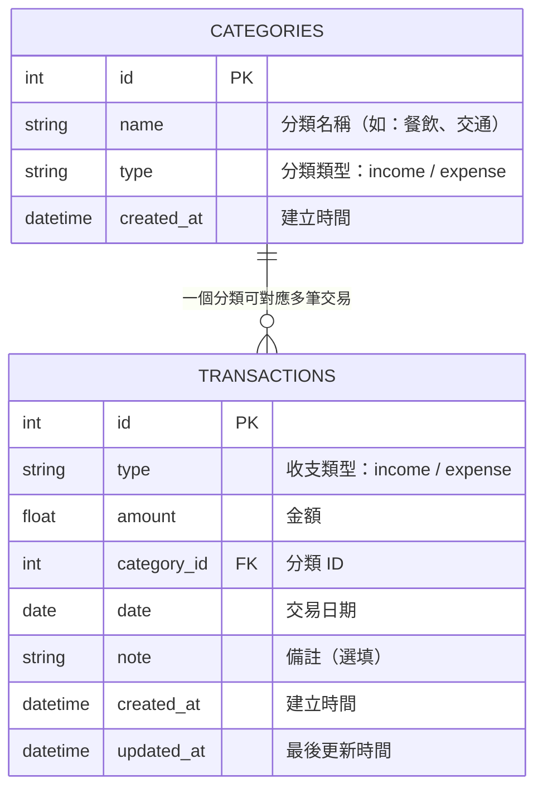

# 資料庫設計文件 (DB Design) - 個人記帳簿系統

本文件根據 `docs/PRD.md` 與 `docs/FLOWCHART.md`，定義個人記帳簿系統所需的資料庫表格結構、欄位說明與建表語法。

---

## 1. ER 圖（實體關係圖）

本系統僅需一張主要資料表 `transactions`，用來儲存所有收入與支出紀錄。另有一張 `categories` 資料表，預先定義分類選項，並透過外鍵與交易紀錄關聯。

---

## 2. 資料表詳細說明

### 2-1. `categories` — 分類資料表

用來儲存收入與支出的分類項目（如：餐飲、薪資、交通等），系統初始化時會預先建立預設分類。

| 欄位名稱 | 型別 | 必填 | 說明 |
| --- | --- | --- | --- |
| `id` | INTEGER | ✅ | 主鍵，自動遞增 (PK) |
| `name` | TEXT | ✅ | 分類名稱（如：餐飲、交通、薪資） |
| `type` | TEXT | ✅ | 分類類型，`income` 或 `expense` |
| `created_at` | TEXT | ✅ | 建立時間（ISO 8601 格式），預設為當前時間 |

### 2-2. `transactions` — 收支紀錄資料表

用來儲存使用者的每一筆收入或支出紀錄。

| 欄位名稱 | 型別 | 必填 | 說明 |
| --- | --- | --- | --- |
| `id` | INTEGER | ✅ | 主鍵，自動遞增 (PK) |
| `type` | TEXT | ✅ | 收支類型，`income`（收入）或 `expense`（支出） |
| `amount` | REAL | ✅ | 金額（經過四則運算後的最終數值） |
| `category_id` | INTEGER | ✅ | 外鍵，關聯 `categories.id` (FK) |
| `date` | TEXT | ✅ | 交易日期（格式：`YYYY-MM-DD`），預設為今日 |
| `note` | TEXT | ❌ | 備註說明（選填） |
| `created_at` | TEXT | ✅ | 建立時間（ISO 8601 格式），預設為當前時間 |
| `updated_at` | TEXT | ✅ | 最後更新時間（ISO 8601 格式），預設為當前時間 |

---

## 3. SQL 建表語法

完整的建表 SQL 語法請參見 `database/schema.sql`。

---

## 4. Python Model 程式碼

Model 程式碼位於 `app/models/` 資料夾，使用 Python 內建的 `sqlite3` 模組操作資料庫，每個 Model 包含完整的 CRUD 方法。

- `app/models/__init__.py` — 資料庫連線初始化
- `app/models/category.py` — 分類 Model（含預設分類初始化）
- `app/models/transaction.py` — 收支紀錄 Model（含統計查詢方法）
