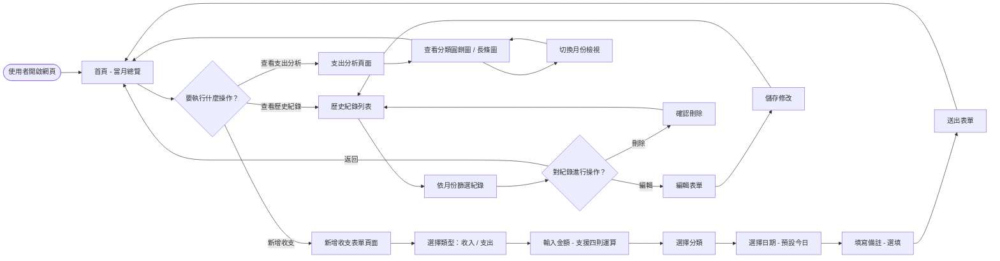
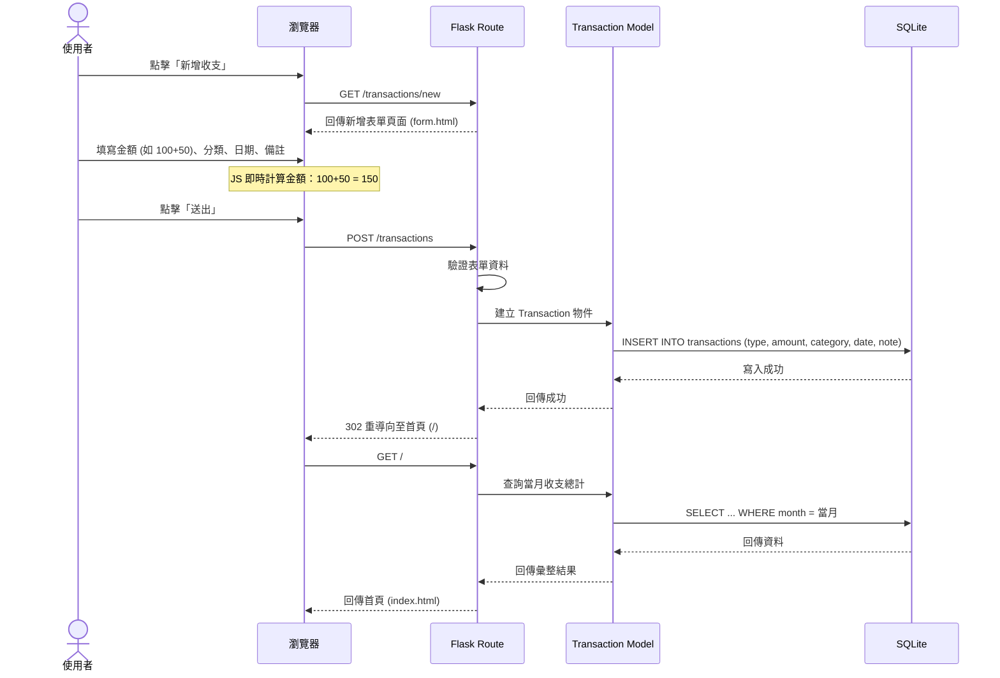
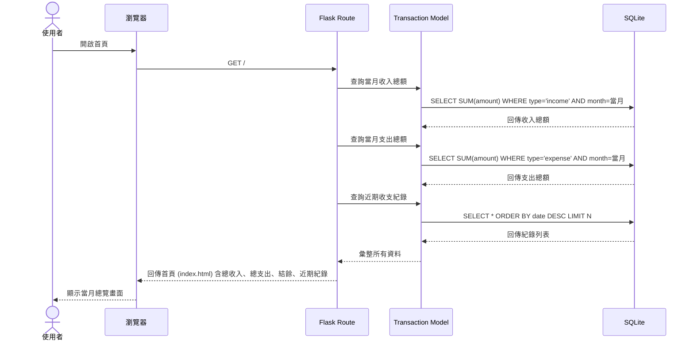
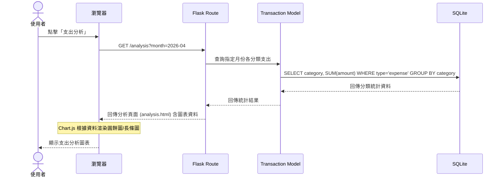

# 流程圖文件 (Flowchart) - 個人記帳簿系統

本文件根據 `docs/PRD.md` 與 `docs/ARCHITECTURE.md`，以 Mermaid 語法呈現使用者操作流程與系統內部資料流動方式。

---

## 1. 使用者流程圖（User Flow）

以下流程圖描述使用者從進入網站開始，可進行的所有主要操作路徑。

### 流程說明

- **首頁（當月總覽）**：使用者進入網站後，首先看到當月的總收入、總支出與結餘金額，以及近期的收支紀錄摘要。
- **新增收支**：使用者可以透過表單新增一筆收入或支出。金額欄位支援直接輸入四則運算式（如 `100+50*2`），系統會自動計算結果。日期預設為今日，也可手動選擇其他日期。
- **歷史紀錄**：使用者可以瀏覽所有收支紀錄，並依月份進行篩選。每筆紀錄都可以進行編輯或刪除操作。
- **支出分析**：使用者可以查看支出的統計圖表（圓餅圖或長條圖），依分類或月份來分析消費習慣。

---

## 2. 系統序列圖（Sequence Diagram）

### 2-1. 新增一筆收支紀錄

描述使用者從填寫表單到資料寫入資料庫的完整流程。

### 2-2. 查看首頁（當月總覽）

描述使用者進入首頁時，系統如何從資料庫撈取並呈現當月財務摘要。

### 2-3. 查看支出分析

描述使用者查看支出統計圖表時，系統的資料查詢流程。

---

## 3. 功能清單對照表

以下表格列出所有功能對應的 URL 路徑、HTTP 方法與簡要說明。

| 功能 | URL 路徑 | HTTP 方法 | 說明 |
| --- | --- | --- | --- |
| 首頁（當月總覽） | `/` | GET | 顯示當月總收入、總支出、結餘及近期紀錄 |
| 新增收支表單 | `/transactions/new` | GET | 顯示新增收入/支出的表單頁面 |
| 送出新增收支 | `/transactions` | POST | 處理表單提交，將紀錄寫入資料庫 |
| 歷史紀錄列表 | `/transactions` | GET | 顯示所有收支紀錄，支援依月份篩選 |
| 編輯收支表單 | `/transactions/<id>/edit` | GET | 顯示指定紀錄的編輯表單 |
| 更新收支紀錄 | `/transactions/<id>` | POST | 處理編輯表單提交，更新資料庫中的紀錄 |
| 刪除收支紀錄 | `/transactions/<id>/delete` | POST | 刪除指定的收支紀錄 |
| 支出分析 | `/analysis` | GET | 顯示支出統計圖表（支援月份篩選） |
